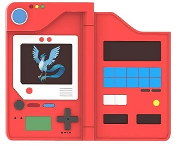
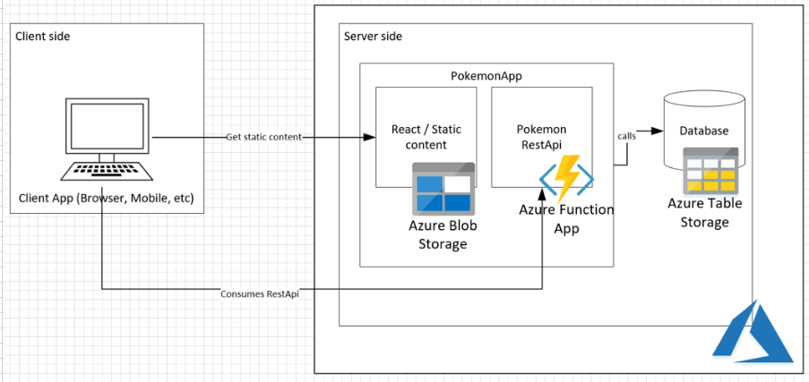

**TecWeb 2023 | Digital Future: da Universidade ao Mundo Empresarial**

# Who is CGI? 🤔
* Let's check who we are [here](../teoria/cgi-intro.pdf)

# Workshop ULHT - CGI | Cloud Native Development using Azure ☁️

**Abstract**📚: Technical training session focused on developing cloud-based applications using the Microsoft Azure platform. The workshop covers the best practices, technologies, and tools for cloud native development in Azure and helps participants gain a comprehensive understanding of how to build, deploy, and manage cloud-based applications on the Azure platform. 
In this workshop you will be able to build a back-end using **Python** and deployed it has a Azure Functions therefore following a Serverless architecture. For the front-end you will learn to build a **ReactJS** application and deployed to be scalable in Azure. The workshop will also cover topics such as serverless architectures, DevOps practices, and Azure deployment patterns.

**Workshop agenda** 📅
| Mon - 06/03 | Tue - 07/03 | Wen - 08/03 | Thu - 09/03 |
|-------------|-------------|-------------|-------------|
|10:00 - 12:30|10:00 - 12:30|10:00 - 12:30|10:00 - 12:30|

**Location**🗺️: CGI Innovation Lab (Incubadora PLAY- Campo Grande 376) & Classroom F.3.7.

**Technologies:** 💻
* **Cloud:** 
    * Microsoft Azure:
        * Azure Functions for API’s (Serverless);
        * Azure Blob Storage for the Front-end.
* **Front-end:** 
    * ReactJS;
* **Back-end:**
    * Python.

**PRE-REQUISITES** ✔️:
* **Workshop Registration** Please fill this [form](https://forms.gle/SqbcLbLPomcdubqZ8) with your University details in order to register in the workshop and so we can send you the invitation links for the Azure Portal/Subscriptions;
* **Azure for students account creation**: Create a [Azure for Students](https://azure.microsoft.com/en-us/free/students/) account;
* **Accept the invitation** sent by the instructors to join to workshop subscription and tenant;
* **Configure your environment**: Before you begin, make sure that you have the following requirements in place:
    * An Azure account with an active subscription. Create an account for free with the invitation link that you will receive from the instructors.
    * [NodeJS](https://nodejs.org/en/);
    * The [Azure Functions Core Tools](https://learn.microsoft.com/en-us/azure/azure-functions/functions-run-local#install-the-azure-functions-core-tools) version 4.x.
    * Python versions that are [supported by Azure Functions](https://learn.microsoft.com/en-us/azure/azure-functions/supported-languages#languages-by-runtime-version). Install [Python 3.10](https://www.python.org/downloads/release/python-31010//);
      * **Note**: During the installation make sure in the first step you select the checkbox that states "... add Python to PATH..."
    * [Visual Studio Code](https://code.visualstudio.com/download);
        * The [Python extension](https://marketplace.visualstudio.com/items?itemName=ms-python.python) for Visual Studio Code.
        * The [Azure Functions extension](https://marketplace.visualstudio.com/items?itemName=ms-azuretools.vscode-azurefunctions) for Visual Studio Code, version 1.8.3 or a later version.
    * [Git](https://git-scm.com/downloads).

# Let's start with some theory 🤓
* Let's first start with some [slides](../teoria/Eng.%20Software%20-%20Arquiteturas%20de%20Software.pdf)

# Tech Glossary 📖
|    Term     |
|-------------|
|**[Azure](https://learn.microsoft.com/en-us/training/azure/)**|
|[Azure Misc](https://learn.microsoft.com/en-us/azure/azure-glossary-cloud-terminology)|
|[Azure Functions](https://learn.microsoft.com/en-us/azure/azure-functions/functions-overview)|
|[Storage Account](https://learn.microsoft.com/en-us/azure/storage/common/storage-account-overview)|
|[Table Storage](https://learn.microsoft.com/en-us/azure/storage/tables/table-storage-overview)|
|[Blob Storage](https://learn.microsoft.com/en-us/azure/storage/blobs/storage-blobs-introduction)|
|[Application Insights](https://learn.microsoft.com/en-us/azure/azure-monitor/app/app-insights-overview?tabs=net)|
|[App Service plan](https://learn.microsoft.com/en-us/azure/app-service/overview-hosting-plans)|
||
|**[Pyhton](https://www.w3schools.com/python/)**|
||
|**[React](https://reactjs.org/docs/getting-started.html)**|
||
|**[npm](https://docs.npmjs.com/cli/v9/commands)**|

# Project 🛠️

**Goal**🎯: Create a Pokemon management application aka Pokedex. In this application the user should be allowed to managed Pokemons, their powers and other characteristics that you think would be good the save, use your imagination.
The main porpuse is to build a web based application using moderns technologies and best practices.

**Datamodel**:

|  Pokemon Entity    | Values and relevant information                                                                                                           |
|--------------------|-------------------------------------------------------------------------------------------------------------------------------------------|
| 'pokemonName' (pk) | str                                                                                                                                       |
| 'pokedexNumber'    | positive integer                                                                                                                          |
| 'pokemonType'      | (str) - 'normal','fire', 'water', 'grass', 'electric', 'ice', 'fighting', 'poison', 'flying', 'bug', 'psychic', 'ghost', 'dark', 'dragon' |
| 'pokemonColor'     | (str) - 'red', 'green' ,'blue', 'yellow', 'black', 'white', 'purple', 'orange', 'pink'                                                    |
| 'pokemonAttacks'   | [str]                                                                                                                                     |

* **Datamodel Rules**:
    * A Pokemon can have more than one PokemonAttack;
    * The 'pokemonName' is unique, we can't have two pokemons with the same name;
    * The 'pokedexNumber' is unique, we can't have two pokemons with the same number;
    * The 'pokemonColor' and 'pokemonType' are finite values (examples are given in table above).

**Business Rules**
* A web application, accessible from a web browser;
* Data should persist and not disappear when the application is restarted;
* Application accessible from anywhere in the world;
* It should be possible to create, read, update and delete a Pokemon and it's attacks.

**Architecture**

# Exercise | Part 1 | Create or first Function App ⚡

**What are Azure functions?**

Functions allow to run serverless code, code that you run only when you need it and that doesn’t need a whole infrastructure to live in. You can decide that a function is triggered when hitting an HTTP endpoint, or when new files are added into a blob storage for instance. It might always perform the same task, or it might do something different depending on your inputs. Basically, you can write code that does (almost) anything you can think of and host it as an Azure Function.

It’s really convenient and as a bonus, it’s cheap: you pay a fraction of a dollar for a million requests and the first million is free — that is unless you decide to go for the hosted plan (like a regular web app) and not the consumption plan.

For more information on Azure functions, [take a look at the documentation]((https://learn.microsoft.com/en-us/azure/azure-functions/functions-overview)).